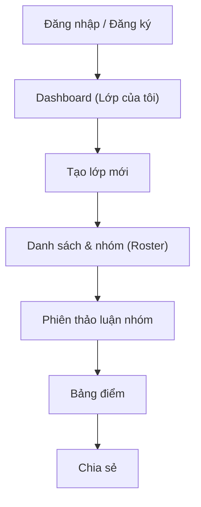
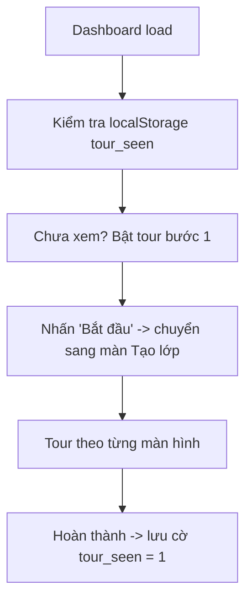

# Kế hoạch: Tour hướng dẫn luồng người dùng (Giáo viên)

## 1. Mục tiêu

- Giúp giáo viên mới tự làm quen toàn bộ vòng đời: **Đăng nhập → Tạo lớp → Phân nhóm → Tạo phiên thảo luận → Chấm điểm → Chia sẻ**.
- Giảm thao tác "mò mẫm" khi lần đầu vào app, tăng tỷ lệ giữ chân người dùng.
- Tour chỉ dành cho **vai giáo viên** (phạm vi đã chốt). Không bao phủ luồng học sinh.
- Triển khai bằng **thư viện có sẵn** (ưu tiên `react-joyride`), không viết component spotlight từ đầu.

## 2. Luồng người dùng giáo viên hiện tại

### 2.1 Sơ đồ tổng quan



### 2.2 Bản đồ màn hình → file triển khai

| # | Màn hình | Route | File chính | Vai trò trong tour |
|---|----------|-------|-----------|--------------------|
| 1 | Trang chủ / đăng nhập | `/` , `/auth/login` | `app/page.tsx`, `app/auth/login/page.tsx` | Cổng vào |
| 2 | Dashboard | `/dashboard` | `app/dashboard/page.tsx`, `app/dashboard/create-class-card.tsx` | Bắt đầu tour onboarding |
| 3 | Chi tiết lớp + tabs | `/classes/[id]` | `app/classes/[id]/layout.tsx`, `app/classes/[id]/class-tabs.tsx` | Thanh điều hướng chính |
| 4 | Danh sách & nhóm | `/classes/[id]/roster` | `app/classes/[id]/roster/roster-view.tsx` | Bước phân nhóm |
| 5 | Phiên thảo luận | `/classes/[id]/sessions` | `app/classes/[id]/session-list-view.tsx` | Tạo phiên |
| 6 | Màn chiếu phiên | `/classes/[id]/sessions/[sid]` | `app/classes/[id]/sessions/[sid]/group-board.tsx` | Điều khiển phiên |
| 7 | Bảng điểm | `/classes/[id]/gradebook` | `app/classes/[id]/gradebook/gradebook-view.tsx` | Chấm / xuất điểm |
| 8 | Chia sẻ | `/classes/[id]/share` | `app/classes/[id]/share/share-view.tsx` | Đưa link cho HS |

## 3. Lựa chọn thư viện

### 3.1 So sánh

| Tiêu chí | react-joyride | driver.js |
|----------|---------------|-----------|
| Kiểu tương tác | Tooltip + spotlight từng bước (step) | Hướng dẫn đa bước kiểu tour |
| Tiếng Việt / locale | Có hỗ trợ `locale` | Phải tự viết nội dung |
| API đơn giản | Cao (`steps`, `run`, `stepIndex`) | Thấp (CSS class `driven`), tùy biến nhiều |
| Phù hợp React/Next.js | Tốt, có `react-joyride` hooks | OK nhưng kiểu imperative |
| Trạng thái / callback | `onStepChange`, `onTourEnd` | `onHighlighted`, tay lái |
| Bundle size | ~45 kB | ~9 kB (nhẹ hơn) |

### 3.2 Khuyến nghị

Dùng **`react-joyride`** vì:

- Là component React (khai báo, dễ nhúng vào app Next.js 16 / React 19 hiện tại).
- Có sẵn `floater` / `spotlight`, `disableBeacon`, `showSkipButton`, hỗ trợ tiếng Việt qua `locale`.
- `onStepChange` cho phép **chờ user thao tác rồi mới chuyển bước** (điều hướng giữa các trang).

Nếu team ưu tiên bundle nhỏ, cân nhắc `driver.js` — nhưng cần viết wrapper nhiều hơn.

Cài đặt đề xuất:

```bash
npm install react-joyride
```

## 4. Kiến trúc tích hợp

### 4.1 Thành phần đề xuất

- `components/tour/teacher-tour.tsx` — component chứa `<Joyride>` + logic chạy tour (props: `tourId`, `steps`, `seenKey`, `autoStart?`, `autoStartWhen?`, `onComplete?`, `isSeen?`, `markSeen?`). Xử lý `STEP_AFTER` + `step.data.navigateTo` → `router.push`; `TOUR_END` + `FINISHED` → `markSeen()`; lắng nghe `RESTART_EVENT` để replay.
- `components/tour/tour-config.ts` — định nghĩa các tour và bước (steps), locale VN + options (zIndex 200). Gồm factory cho Dashboard, Roster, Sessions, Gradebook, Share và các step hint màn chiếu PowerPoint.
- `components/tour/tour-store.ts` — keys + tiện ích đọc/ghi localStorage/sessionStorage (`getSeen/setSeen`, `rosterTourSeen`, `setGradebookTourPending`, `consumeGradebookTourPending`, …).
- `components/tour/tour-replay-button.tsx` — nút "Hướng dẫn" trên header, dispatch `RESTART_EVENT`.
- `components/tour/presentation-tour.tsx` — tour màn chiếu PowerPoint (state machine `idle → edge → drawer → all-sessions → create-session → done`), progressive theo hành động thật.
- `components/tour/roster-tour.tsx` — tour phân nhóm (state machine `idle → list → leader → next → done`), progressive theo hành động thật (kéo HS vào nhóm → gán nhóm trưởng).

Luồng chạy:



### 4.2 Định dạng step (react-joyride)

```ts
type TeacherStep = {
  target: string            // CSS selector, nên dùng data-tour="..."
  content: string           // Nội dung tiếng Việt
  placement?: "top" | "bottom" | "left" | "right" | "center"
  title?: string
  disableBeacon?: boolean
  // Bước điều hướng sang trang khác (thường là step cuối của màn hình)
  navigateTo?: string
}
```

Mỗi màn hình sẽ được gắn thuộc tính `data-tour="..."` vào các element cần spotlight (thêm vào file UI hiện có, không đổi hành vi).

### 4.3 Persistence (lưu trạng thái)

- Key tổng: `teacher_tour_seen_v1` — set khi hoàn tất tour cuối (Chia sẻ), đánh dấu đã xong onboarding. Các tour màn chiếu / phiên / bảng điểm chỉ tự hiện khi key này **chưa** set.
- Tour Dashboard: `teacher_tour_dashboard_seen_v1` (toàn cục, chỉ hiện lần đầu).
- Tour Phân nhóm: `teacher_tour_roster_seen_v1` (**toàn cục, chỉ hiện lần đầu** — không theo lớp). Vẫn quét cờ cũ `roster_intro_seen_<classId>` để tương thích người đã xem modal cũ.
- Tour Phiên thảo luận / Bảng điểm: `teacher_tour_<tour>_<classId>` (theo lớp) nhưng chỉ tự hiện khi `teacher_tour_seen_v1` chưa set.
- Tour Bảng điểm: chỉ tự chạy khi giáo viên **chủ động bấm tab "Bảng điểm"** — tab click đặt marker `teacher_tour_gradebook_pending_v1` (sessionStorage) trước khi navigate; `gradebook-view` đọc + xoá marker khi mount rồi mới bật tour.
- Hint màn chiếu: `teacher_tour_presentation_start_seen_v1` (hint "Chế độ chiếu lớp" trên board) và `teacher_tour_presentation_seen_v1` (tour màn chiếu PowerPoint, set khi bấm "Tạo phiên mới").
- `RESTART_EVENT = "teacher-tour:restart"` — event replay từ nút "Hướng dẫn" trên header.
- Giá trị cờ: `"1"` khi đã xem/hoàn thành.

### 4.4 Nút mở lại tour

- Thêm nút "Hướng dẫn" (icon `HelpCircle` / `Info`) trên `components/teacher-shell.tsx` (header toàn app) để giáo viên mở lại tour bất cứ lúc nào.
- Khi nhấn: chạy lại tour từ đầu (reset cờ trong session, không xóa cờ localStorage).

## 5. Chi tiết nội dung tour theo màn hình

### 5.1 Tour onboarding tổng quan — Dashboard

Mục tiêu: giới thiệu bức tranh tổng thể, dẫn dắt sang bước tạo lớp.

| Bước | Target (data-tour) | Nội dung | Điều hướng |
|------|--------------------|----------|-----------|
| 1 | Header / `data-tour="dashboard-header"` | Chào mừng: "Đây là nơi quản lý tất cả lớp học của bạn." | - |
| 2 | `data-tour="create-class"` (nút "Tạo lớp mới") | "Nhấn để tạo lớp đầu tiên. Bạn chỉ cần nhập tên lớp, sĩ số và số nhóm cố định." | Chuyển tới bước mở dialog |
| 3 | `data-tour="create-class-form"` | "Nhập thông tin rồi bấm Tạo lớp. Sau đó app sẽ đưa bạn vào trang phân nhóm." | `navigateTo: /classes/[id]/roster` |

Ghi chú: bước 3 cần lấy `classId` vừa tạo — component tour sẽ lắng nghe URL thay đổi (`usePathname`) để bắt đầu tour màn hình tiếp theo.

### 5.2 Tour "Danh sách & nhóm" — Roster (progressive)

Mục tiêu: dạy thao tác phân học sinh vào nhóm. Đây là màn hình phức tạp nhất nên có tour riêng, đồng thời **thay thế modal hướng dẫn 5 bước hiện có** (`roster-view.tsx:517-585`) bằng spotlight trực quan hơn.

Triển khai bằng **state machine `components/tour/roster-tour.tsx`** (`idle → list → leader → next → done`). **Từng hint xuất hiện theo hành động thật** của giáo viên, không chạy liên tục một mạch:

| Hint | Target | Nội dung | Kích hoạt |
|------|--------|----------|-----------|
| 1. Danh sách HS | `data-tour="roster-list"` (khung danh sách HS bên trái) | "Đây là danh sách học sinh... Kéo thẻ học sinh từ bên trái thả vào một nhóm bên phải." | Vào trang khi lớp đã có nhóm + chưa xem cờ roster |
| 2. Nhóm trưởng | `data-tour="group-leader"` (nút vương miện) | "Bấm vương miện bên cạnh tên nhóm để gán nhóm trưởng." | Giáo viên **kéo ≥1 HS vào nhóm** (`groups.some(g => g.members.length > 0)`) |
| 3. Chuyển tab | `data-tour="class-tabs"` (thanh tabs) | "Phân nhóm xong, bấm tab Thảo luận nhóm..." | Giáo viên **đã gán nhóm trưởng** (`groups.some(g => g.leaderId)`) |

Ghi chú:

- Bỏ bước `bulk-select` và `navigateTo` ở bước cuối (giáo viên tự bấm tab "Thảo luận nhóm").
- Hint tắt khi giáo viên bấm "Tiếp"/"Đóng" tại một hint nhưng chỉ tiến sang hint sau khi có hành động thật.
- Hoàn tất hint cuối (hoặc bấm "Hoàn tất") → `setRosterTourSeen()` (cờ toàn cục).
- Hỗ trợ replay qua `RESTART_EVENT` (nút "Hướng dẫn" trên header).

### 5.3 Tour "Phiên thảo luận nhóm" — Sessions

Mục tiêu: tạo và chạy phiên đầu tiên.

| Bước | Target | Nội dung |
|------|--------|----------|
| 1 | `data-tour="session-create"` (nút tạo phiên) | "Tạo phiên thảo luận: chọn loại nhóm, đặt thời lượng." |
| 2 | `data-tour="session-presets"` (các preset 15/30/45 phút) | "Chọn nhanh theo preset hoặc tự nhập số phút." |
| 3 | `data-tour="session-list"` | "Phiên sau khi tạo hiện ở đây. Nhấn vào phiên để mở màn chiếu." |
| 4 | `data-tour="class-tabs"` | "Khi kết thúc phiên, mở Bảng điểm để chấm." → `navigateTo: /classes/[id]/gradebook` |

### 5.4 Tour "Bảng điểm" — Gradebook

> **Trigger đặc biệt**: tour chỉ tự chạy khi giáo viên **chủ động bấm tab "Bảng điểm"** (xem 4.3). Không tự hiện khi vào trang bằng đường dẫn trực tiếp.

| Bước | Target | Nội dung |
|------|--------|----------|
| 1 | `data-tour="gradebook-table"` | "Mỗi cột là một phiên, mỗi hàng là một học sinh. Điểm tự động tổng hợp." |
| 2 | `data-tour="gradebook-export"` | "Xuất bảng điểm cuối kỳ ra file." |
| 3 | `data-tour="class-tabs"` | "Cuối cùng, tự bấm tab \"Chia sẻ\" để gửi link cho học sinh xem điểm." (không `navigateTo` — nhắc GV tự bấm tab) |

### 5.5 Tour "Chia sẻ" — Share (bước kết thúc, progressive)

> **Mốc kết thúc onboarding**: tour Chia sẻ là bước cuối của onboarding. Khi hint cuối (`share-grades`) kết thúc — giáo viên copy link điểm (`stopGradesHint`) hoặc đóng/hoàn tất hint (`onEnd`) — gọi `setSeen(TOUR_ONBOARDING_SEEN_KEY)`.

| Bước | Target | Nội dung | Kích hoạt |
|------|--------|----------|-----------|
| 1 | `data-tour="share-link"` | "Copy link này gửi cho học sinh. Học sinh dùng link để vào lớp và nộp bài." | Vào trang + onboarding chưa xong + chưa dismiss |
| 2 | `data-tour="share-grades"` | "Copy link này để học sinh xem điểm (chỉ xem)." | Copy link lớp **hoặc đóng hint link** (`onEnd` share-link → hiện hint grades) |
| Xong | — | Kết thúc | Copy link điểm / `onEnd` hint grades → `setSeen(teacher_tour_seen_v1)` |

Sau khi `teacher_tour_seen_v1` được set, các tour màn chiếu / phiên / bảng điểm **không còn auto-start** (đều gate `!getSeen(TOUR_ONBOARDING_SEEN_KEY)`).

### 5.6 Tour "Màn chiếu PowerPoint" — Presentation (progressive)

Tour màn hình chiếu lớp khi giáo viên đã upload PowerPoint, triển khai bằng state machine trong `components/tour/presentation-tour.tsx`. **Từng hint xuất hiện theo hành động thật** của giáo viên, không chạy liên tục một mạch:

- `idle → edge → drawer → all-sessions → create-session → done`.

Điều kiện bật (`enabled`): onboarding chưa xong (`teacher_tour_seen_v1` chưa set) **và** chưa xem tour màn chiếu (`teacher_tour_presentation_seen_v1` chưa set).

| Giai đoạn | Target (data-tour) | Nội dung | Kích hoạt |
|-----------|--------------------|----------|-----------|
| Hint board (ngoài màn chiếu) | `presentation-start` (nút "Chế độ chiếu lớp", `group-board.tsx`, chỉ `isTeacher`) | "Bấm để mở PowerPoint ra toàn màn hình" | Tự hiện khi có PowerPoint + chưa xem onboarding; set `teacher_tour_presentation_start_seen_v1` khi bấm bắt đầu chiếu |
| 1. Mép trái | `presentation-edge` (vùng hover `w-10` mép trái, `presentation-viewer.tsx`) | "Di chuột mép trái để mở bảng điều khiển" | Vào màn chiếu (fullscreen active) |
| 2. Drawer | `presentation-timer` (chỉnh thời gian) → `presentation-qr` (nút "QR code" trong drawer) | Hướng dẫn bảng điều khiển ẩn | Giáo viên mở drawer; stage này `continuous` 2 bước |
| 3. Tất cả phiên | `presentation-all-sessions` (nút "Tất cả phiên" trong `renderBoard` embedded) | "Xem/chọn phiên khác" | Giáo viên bấm "Tất cả phiên" |
| 4. Tạo phiên mới | `presentation-create-session` (nút trong picker, chỉ tồn tại khi `sessionPickerOpen`) | "Tạo phiên mới ngay trong lúc chiếu" | Giáo viên bấm "Tạo phiên mới" trong picker |
| 5. Xong | — | Kết thúc | Bấm "Tạo phiên mới" → set `teacher_tour_presentation_seen_v1` |

Ghi chú kỹ thuật:

- `PresentationTour` dùng `key={`presentation-${stage}`}` để remount Joyride theo stage; chỉ stage "drawer" là multi-step (`continuous`), các stage khác là hint đơn. Lắng nghe `RESTART_EVENT`: khi đang chiếu (`active`) → `setReplaying(true)` + stage theo UI (picker → `create-session`, drawer → `drawer`, không thì `edge`) + remount 120ms. Overlay fullscreen có nút HelpCircle cạnh X vì header bị đè.
- Drawer fullscreen render nội dung bằng `board(openGroup)` = `renderBoard(true, …)` → các target `presentation-timer/all-sessions/create-session` nằm trong `renderBoard` (nhánh embedded). Nút QR nằm riêng ở header drawer của `presentation-viewer.tsx`.
- `startPresentation()` set `teacher_tour_presentation_start_seen_v1` để hint board không hiện lại.
- Toàn bộ hint màn chiếu nằm trong block `isTeacher` nên học sinh không thấy.

## 6. Trạng thái hoàn thành & replay

- **Lần đầu**: tour onboarding tự động hiện ở Dashboard khi `teacher_tour_seen_v1` chưa tồn tại.
- **Tour cục bộ** (Roster): tự hiện **lần đầu tiên duy nhất** (cờ toàn cục `teacher_tour_roster_seen_v1`) khi lớp đã có nhóm và chưa xem cờ; không hiện lại khi tạo lớp mới (vẫn quét cờ cũ `roster_intro_seen_*` để tương thích người đã xem modal cũ). **Progressive theo hành động**: hint danh sách HS → (kéo ≥1 HS vào nhóm) → hint nhóm trưởng → (gán leader) → hint chuyển tab.
- **Tour màn chiếu PowerPoint**: tự hiện khi onboarding chưa xong + chưa xem cờ `teacher_tour_presentation_seen_v1`; tiến theo hành động thật (xem 5.6), set cờ khi bấm "Tạo phiên mới".
- **Tour Bảng điểm**: chỉ tự chạy khi giáo viên bấm tab "Bảng điểm" (marker sessionStorage), không tự hiện khi mở trang trực tiếp.
- **Replay**: nút "Hướng dẫn" trên header (dispatch `RESTART_EVENT`) mở lại tour của trang hiện tại, không ghi đè cờ đã xem. TeacherTour, RosterTour, PresentationTour, Sessions, Share (`shareReplay` chạy 2 hint) đều lắng nghe. Overlay chiếu có nút riêng. Dashboard đóng form tạo lớp để hiện lại `data-tour='create-class'`.
- **Bỏ qua**: nút "Bỏ qua" cho phép kết thúc sớm; lần sau vẫn hiện lại (trừ khi đã hoàn thành).

## 7. Rủi ro & lưu ý kỹ thuật

1. **SSR / hydration**: `<Joyride>` chỉ render ở client; guard `typeof window !== "undefined"` và trì hoãn bật tour đến sau `useEffect`.
2. **Target chưa có khi render**: các màn hình load dữ liệu bất đồng bộ (Roster, Gradebook) — cần bật tour sau khi dữ liệu có (dùng `floater` + `disableScrollParent`), hoặc delay.
3. **Điều hướng giữa trang**: tour xuyên trang cần quản lý `stepIndex` theo `usePathname`; mỗi trang mount phải tự khôi phục step tương ứng, không nên giữ state trong component tour ở trang cũ.
4. **Tiếng Việt**: truyền `locale` của react-joyride (close, skip, next, back, last) bằng tiếng Việt.
5. **CSS xung đột**: đảm bảo `z-index` spotlight thấp hơn header sticky (`z-30`) hoặc đặt cao hơn tùy vị trí; kiểm tra trong cả theme sáng/tối.
6. **Không đổi hành vi hiện có**: chỉ thêm `data-tour` + đổi modal Roster sang spotlight, không refactor logic.

## 8. Checklist triển khai

**Giai đoạn 1 — Hạ tầng** (đã xong)
- [x] Cài `react-joyride` (npm, v3.2.0 — dùng `import { Joyride }` named export).
- [x] Tạo `components/tour/tour-config.ts`: định nghĩa tour cho Dashboard, Roster, Sessions, Gradebook, Share + step hint màn chiếu.
- [x] Tạo `components/tour/tour-store.ts`: tiện ích localStorage/sessionStorage + keys.
- [x] Tạo `components/tour/teacher-tour.tsx`: `<Joyride>` + logic điều hướng theo pathname.
- [x] Tạo `components/tour/presentation-tour.tsx`: tour màn chiếu PowerPoint (state machine).
- [x] Tạo `components/tour/roster-tour.tsx`: tour phân nhóm progressive (state machine).

**Giai đoạn 2 — Gắn vào UI hiện có** (đã xong)
- [x] `components/teacher-shell.tsx`: thêm nút "Hướng dẫn" (replay, dispatch `RESTART_EVENT`).
- [x] `app/dashboard/page.tsx` + `create-class-card.tsx`: gắn `data-tour` + tour onboarding.
- [x] `app/classes/[id]/class-tabs.tsx`: gắn `data-tour="class-tabs"` + marker khi bấm tab Bảng điểm.
- [x] `app/classes/[id]/roster/roster-view.tsx`: gắn `data-tour` cho list HS, cột nhóm, vương miện, bulk select.
- [x] `app/classes/[id]/session-list-view.tsx`: gắn `data-tour` cho nút tạo phiên, danh sách.
- [x] `app/classes/[id]/gradebook/gradebook-view.tsx`: gắn `data-tour` cho bảng điểm, nút xuất file; trigger qua marker tab.
- [x] `app/classes/[id]/share/share-view.tsx`: gắn `data-tour` cho link chia sẻ, điểm, bước hoàn tất; set `teacher_tour_seen_v1` khi hoàn thành.
- [x] `app/classes/[id]/sessions/[sid]/group-board.tsx` + `components/presentation-viewer.tsx`: gắn hint/tour màn chiếu PowerPoint.

**Giai đoạn 3 — Kiểm thử** (còn tồn đọng, xem bangiao5)
- [x] Test luồng onboarding từ Dashboard → tạo lớp → roster → sessions → gradebook → share (6b: script `pnpm run check:tour` + rà gate/`data-tour`; đóng hint Share-link vẫn mở grades rồi set cờ tổng).
- [x] Test 2 lần chạy liên tiếp để xác nhận cờ localStorage (không hiện lại khi đã xem) — 6b script PASS.
- [x] Test replay bằng nút "Hướng dẫn" (6c: Share 2 hint, Dashboard đóng form, chiếu nút overlay + stage theo UI).
- [x] Test trên theme sáng/tối, màn hình nhỏ (mobile) — `useTourOptions` + CSS tooltip + nút compact + `onTouchStart` mép trái (6c).
- [x] Chạy `pnpm run lint` và `pnpm run typecheck` (hiện pass, chỉ warning `` pre-existing).
- [x] HTML giả lập màn chiếu (7a): `docs/tour-demo/presentation.html` — 4 cảnh `?scene=edge|drawer|all-sessions|create-session`.
- [x] Ảnh demo màn chiếu (7b+7c): 4 PNG + `docs/tour-screenshots/index.html`.
- [x] 8a: typecheck + lint + build + `check:tour` trên `main` (PR #4 đã merge).

## 9. Đánh giá thành công

- ≥ 80% giáo viên mới hoàn thành tour onboarding.
- Giảm số câu hỏi trợ giúp về thao tác phân nhóm / tạo phiên.
- Không phát sinh lỗi hydration hoặc crash tại các màn hình có tour.
