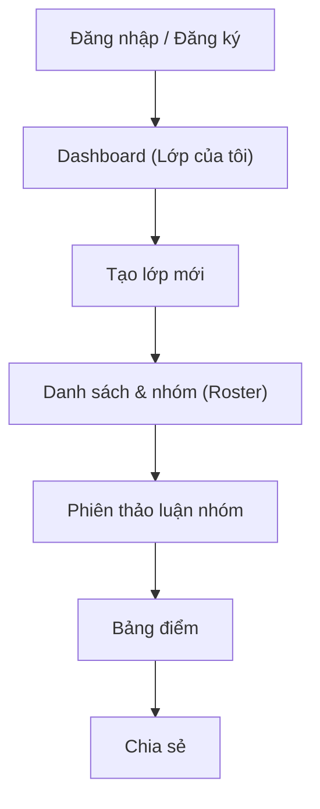
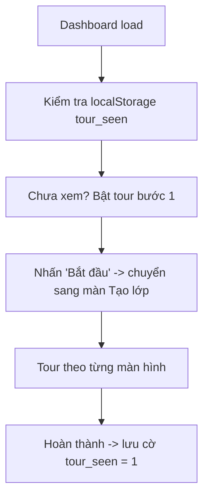

# Kế hoạch: Tour hướng dẫn luồng người dùng (Giáo viên)

## 1. Mục tiêu

- Giúp giáo viên mới tự làm quen toàn bộ vòng đời: **Đăng nhập → Tạo lớp → Phân nhóm → Tạo phiên thảo luận → Chấm điểm → Chia sẻ**.
- Giảm thao tác "mò mẫm" khi lần đầu vào app, tăng tỷ lệ giữ chân người dùng.
- Tour chỉ dành cho **vai giáo viên** (phạm vi đã chốt). Không bao phủ luồng học sinh.
- Triển khai bằng **thư viện có sẵn** (ưu tiên `react-joyride`), không viết component spotlight từ đầu.

## 2. Luồng người dùng giáo viên hiện tại

### 2.1 Sơ đồ tổng quan



### 2.2 Bản đồ màn hình → file triển khai

| # | Màn hình | Route | File chính | Vai trò trong tour |
|---|----------|-------|-----------|--------------------|
| 1 | Trang chủ / đăng nhập | `/` , `/auth/login` | `app/page.tsx`, `app/auth/login/page.tsx` | Cổng vào |
| 2 | Dashboard | `/dashboard` | `app/dashboard/page.tsx`, `app/dashboard/create-class-card.tsx` | Bắt đầu tour onboarding |
| 3 | Chi tiết lớp + tabs | `/classes/[id]` | `app/classes/[id]/layout.tsx`, `app/classes/[id]/class-tabs.tsx` | Thanh điều hướng chính |
| 4 | Danh sách & nhóm | `/classes/[id]/roster` | `app/classes/[id]/roster/roster-view.tsx` | Bước phân nhóm |
| 5 | Phiên thảo luận | `/classes/[id]/sessions` | `app/classes/[id]/session-list-view.tsx` | Tạo phiên |
| 6 | Màn chiếu phiên | `/classes/[id]/sessions/[sid]` | `app/classes/[id]/sessions/[sid]/group-board.tsx` | Điều khiển phiên |
| 7 | Bảng điểm | `/classes/[id]/gradebook` | `app/classes/[id]/gradebook/gradebook-view.tsx` | Chấm / xuất điểm |
| 8 | Chia sẻ | `/classes/[id]/share` | `app/classes/[id]/share/share-view.tsx` | Đưa link cho HS |

## 3. Lựa chọn thư viện

### 3.1 So sánh

| Tiêu chí | react-joyride | driver.js |
|----------|---------------|-----------|
| Kiểu tương tác | Tooltip + spotlight từng bước (step) | Hướng dẫn đa bước kiểu tour |
| Tiếng Việt / locale | Có hỗ trợ `locale` | Phải tự viết nội dung |
| API đơn giản | Cao (`steps`, `run`, `stepIndex`) | Thấp (CSS class `driven`), tùy biến nhiều |
| Phù hợp React/Next.js | Tốt, có `react-joyride` hooks | OK nhưng kiểu imperative |
| Trạng thái / callback | `onStepChange`, `onTourEnd` | `onHighlighted`, tay lái |
| Bundle size | ~45 kB | ~9 kB (nhẹ hơn) |

### 3.2 Khuyến nghị

Dùng **`react-joyride`** vì:

- Là component React (khai báo, dễ nhúng vào app Next.js 16 / React 19 hiện tại).
- Có sẵn `floater` / `spotlight`, `disableBeacon`, `showSkipButton`, hỗ trợ tiếng Việt qua `locale`.
- `onStepChange` cho phép **chờ user thao tác rồi mới chuyển bước** (điều hướng giữa các trang).

Nếu team ưu tiên bundle nhỏ, cân nhắc `driver.js` — nhưng cần viết wrapper nhiều hơn.

Cài đặt đề xuất:

```bash
npm install react-joyride
```

## 4. Kiến trúc tích hợp

### 4.1 Thành phần đề xuất

- `components/tour/teacher-tour.tsx` — component chứa `<Joyride>` + logic chạy tour.
- `components/tour/tour-config.ts` — định nghĩa các tour và bước (steps) dạng dữ liệu tĩnh.
- `components/tour/tour-store.ts` — tiện ích đọc/ghi trạng thái localStorage.
- `hooks/use-teacher-tour.ts` — hook điều khiển: bắt đầu / dừng / đánh dấu hoàn thành.

Luồng chạy:



### 4.2 Định dạng step (react-joyride)

```ts
type TeacherStep = {
  target: string            // CSS selector, nên dùng data-tour="..."
  content: string           // Nội dung tiếng Việt
  placement?: "top" | "bottom" | "left" | "right" | "center"
  title?: string
  disableBeacon?: boolean
  // Bước điều hướng sang trang khác (thường là step cuối của màn hình)
  navigateTo?: string
}
```

Mỗi màn hình sẽ được gắn thuộc tính `data-tour="..."` vào các element cần spotlight (thêm vào file UI hiện có, không đổi hành vi).

### 4.3 Persistence (lưu trạng thái)

- Key: `teacher_tour_seen_v1` (theo user, không theo class).
- Giá trị: `"1"` khi đã hoàn thành tour onboarding lần đầu.
- Tour theo ngữ cảnh (ví dụ tour "Phân nhóm") dùng key riêng: `teacher_tour_roster_seen_<classId>`.
- Cách này **đồng nhất với pattern hiện có** tại `app/classes/[id]/roster/roster-view.tsx:161` (cờ `roster_intro_seen_<classId>`).

### 4.4 Nút mở lại tour

- Thêm nút "Hướng dẫn" (icon `HelpCircle` / `Info`) trên `components/teacher-shell.tsx` (header toàn app) để giáo viên mở lại tour bất cứ lúc nào.
- Khi nhấn: chạy lại tour từ đầu (reset cờ trong session, không xóa cờ localStorage).

## 5. Chi tiết nội dung tour theo màn hình

### 5.1 Tour onboarding tổng quan — Dashboard

Mục tiêu: giới thiệu bức tranh tổng thể, dẫn dắt sang bước tạo lớp.

| Bước | Target (data-tour) | Nội dung | Điều hướng |
|------|--------------------|----------|-----------|
| 1 | Header / `data-tour="dashboard-header"` | Chào mừng: "Đây là nơi quản lý tất cả lớp học của bạn." | - |
| 2 | `data-tour="create-class"` (nút "Tạo lớp mới") | "Nhấn để tạo lớp đầu tiên. Bạn chỉ cần nhập tên lớp, sĩ số và số nhóm cố định." | Chuyển tới bước mở dialog |
| 3 | `data-tour="create-class-form"` | "Nhập thông tin rồi bấm Tạo lớp. Sau đó app sẽ đưa bạn vào trang phân nhóm." | `navigateTo: /classes/[id]/roster` |

Ghi chú: bước 3 cần lấy `classId` vừa tạo — component tour sẽ lắng nghe URL thay đổi (`usePathname`) để bắt đầu tour màn hình tiếp theo.

### 5.2 Tour "Danh sách & nhóm" — Roster

Mục tiêu: dạy thao tác phân học sinh vào nhóm. Đây là màn hình phức tạp nhất nên có tour riêng, đồng thời **thay thế modal hướng dẫn 5 bước hiện có** (`roster-view.tsx:517-585`) bằng spotlight trực quan hơn.

| Bước | Target | Nội dung |
|------|--------|----------|
| 1 | `data-tour="roster-list"` (khung danh sách HS bên trái) | "Đây là danh sách học sinh. Mỗi em có một ô riêng." |
| 2 | `data-tour="roster-groups"` (cột nhóm bên phải) | "Kéo thả thẻ học sinh vào nhóm tương ứng." |
| 3 | `data-tour="group-leader"` (nút vương miện) | "Gán nhóm trưởng — nhóm trưởng có thể tự chọn thêm thành viên." |
| 4 | `data-tour="bulk-select"` | "Giữ Ctrl/Cmd + bấm để chọn nhiều học sinh, kéo cụm vào nhóm." |
| 5 | `data-tour="class-tabs"` (thanh tabs) | "Chuyển sang tab Thảo luận nhóm để bắt đầu phiên đầu tiên." → `navigateTo: /classes/[id]/sessions` |

### 5.3 Tour "Phiên thảo luận nhóm" — Sessions

Mục tiêu: tạo và chạy phiên đầu tiên.

| Bước | Target | Nội dung |
|------|--------|----------|
| 1 | `data-tour="session-create"` (nút tạo phiên) | "Tạo phiên thảo luận: chọn loại nhóm, đặt thời lượng." |
| 2 | `data-tour="session-presets"` (các preset 15/30/45 phút) | "Chọn nhanh theo preset hoặc tự nhập số phút." |
| 3 | `data-tour="session-list"` | "Phiên sau khi tạo hiện ở đây. Nhấn vào phiên để mở màn chiếu." |
| 4 | `data-tour="class-tabs"` | "Khi kết thúc phiên, mở Bảng điểm để chấm." → `navigateTo: /classes/[id]/gradebook` |

### 5.4 Tour "Bảng điểm" — Gradebook

| Bước | Target | Nội dung |
|------|--------|----------|
| 1 | `data-tour="gradebook-table"` | "Mỗi cột là một phiên, mỗi hàng là một học sinh. Điểm tự động tổng hợp." |
| 2 | `data-tour="gradebook-export"` | "Xuất bảng điểm cuối kỳ ra file." |
| 3 | `data-tour="class-tabs"` | "Cuối cùng, chia sẻ link cho học sinh xem điểm." → `navigateTo: /classes/[id]/share` |

### 5.5 Tour "Chia sẻ" — Share (bước kết thúc)

| Bước | Target | Nội dung |
|------|--------|----------|
| 1 | `data-tour="share-link"` | "Copy link này gửi cho học sinh. Học sinh dùng link để vào lớp và nộp bài." |
| 2 | `data-tour="share-scores"` | "Bật chia sẻ điểm để học sinh xem điểm (chỉ xem)." |
| 3 | `data-tour="share-done"` | "Chúc mừng! Bạn đã sẵn sàng dạy. Bấm 'Hoàn tất' để kết thúc tour." |

Sau bước cuối: lưu cờ `teacher_tour_seen_v1 = 1`.

## 6. Trạng thái hoàn thành & replay

- **Lần đầu**: tour onboarding tự động hiện ở Dashboard khi `teacher_tour_seen_v1` chưa tồn tại.
- **Tour cục bộ** (Roster): tự hiện khi lớp đã có nhóm và chưa xem cờ `teacher_tour_roster_seen_<classId>` (giữ logic cũ, chỉ đổi từ modal sang spotlight).
- **Replay**: nút "Hướng dẫn" trên header (mở lại tour từ đầu, không ghi đè cờ đã xem).
- **Bỏ qua**: nút "Bỏ qua" cho phép kết thúc sớm; lần sau vẫn hiện lại (trừ khi đã hoàn thành).

## 7. Rủi ro & lưu ý kỹ thuật

1. **SSR / hydration**: `<Joyride>` chỉ render ở client; guard `typeof window !== "undefined"` và trì hoãn bật tour đến sau `useEffect`.
2. **Target chưa có khi render**: các màn hình load dữ liệu bất đồng bộ (Roster, Gradebook) — cần bật tour sau khi dữ liệu có (dùng `floater` + `disableScrollParent`), hoặc delay.
3. **Điều hướng giữa trang**: tour xuyên trang cần quản lý `stepIndex` theo `usePathname`; mỗi trang mount phải tự khôi phục step tương ứng, không nên giữ state trong component tour ở trang cũ.
4. **Tiếng Việt**: truyền `locale` của react-joyride (close, skip, next, back, last) bằng tiếng Việt.
5. **CSS xung đột**: đảm bảo `z-index` spotlight thấp hơn header sticky (`z-30`) hoặc đặt cao hơn tùy vị trí; kiểm tra trong cả theme sáng/tối.
6. **Không đổi hành vi hiện có**: chỉ thêm `data-tour` + đổi modal Roster sang spotlight, không refactor logic.

## 8. Checklist triển khai

**Giai đoạn 1 — Hạ tầng**
- [ ] Cài `react-joyride` (npm).
- [ ] Tạo `components/tour/tour-config.ts`: định nghĩa 5 tour, mỗi tour là mảng step.
- [ ] Tạo `components/tour/tour-store.ts`: tiện ích localStorage + `use-teacher-tour.ts`.
- [ ] Tạo `components/tour/teacher-tour.tsx`: `<Joyride>` + logic điều hướng theo pathname.

**Giai đoạn 2 — Gắn vào UI hiện có**
- [ ] `components/teacher-shell.tsx`: thêm nút "Hướng dẫn" (replay).
- [ ] `app/dashboard/page.tsx` + `create-class-card.tsx`: gắn `data-tour` cho nút tạo lớp & form; kích hoạt tour onboarding.
- [ ] `app/classes/[id]/layout.tsx` + `class-tabs.tsx`: gắn `data-tour="class-tabs"`.
- [ ] `app/classes/[id]/roster/roster-view.tsx`: thêm `data-tour` cho list HS, cột nhóm, nút vương miện, bulk select; **thay modal hướng dẫn bằng tour spotlight**.
- [ ] `app/classes/[id]/session-list-view.tsx`: `data-tour` cho nút tạo phiên, preset, danh sách.
- [ ] `app/classes/[id]/gradebook/gradebook-view.tsx`: `data-tour` cho bảng điểm, nút xuất file.
- [ ] `app/classes/[id]/share/share-view.tsx`: `data-tour` cho link chia sẻ, toggle điểm, bước hoàn tất.

**Giai đoạn 3 — Kiểm thử**
- [ ] Test luồng onboarding từ Dashboard → tạo lớp → roster → sessions → gradebook → share.
- [ ] Test 2 lần chạy liên tiếp để xác nhận cờ localStorage (không hiện lại khi đã xem).
- [ ] Test replay bằng nút "Hướng dẫn".
- [ ] Test trên theme sáng/tối, màn hình nhỏ (mobile) — ẩn hoặc đơn giản hóa spotlight trên mobile nếu cần.
- [ ] Chạy `npm run lint` và `npm run typecheck`.

## 9. Đánh giá thành công

- ≥ 80% giáo viên mới hoàn thành tour onboarding.
- Giảm số câu hỏi trợ giúp về thao tác phân nhóm / tạo phiên.
- Không phát sinh lỗi hydration hoặc crash tại các màn hình có tour.
